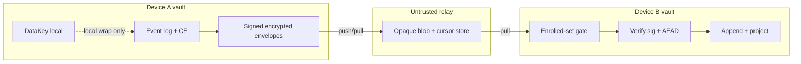

# T175 Threat Model — Encrypted Event Envelope Replication (Untrusted Relay, Single-Owner)

- **Track:** T175-SyncThreatModelAdr (P11.0) — ✅ **Completed**
- **Normative companion:** [ADR-0018](../../../Docs/DECISIONS/ADR-0018-encrypted-event-replication-protocol.md) — **Accepted** 2026-07-30 (after Codex R3 PASS)
- **Implements direction of:** [ADR-0015](../../../Docs/DECISIONS/ADR-0015-event-ledger-erasure-and-encrypted-replication.md), [ADR-0016](../../../Docs/DECISIONS/ADR-0016-content-envelope-cryptography.md)
- **Date:** 2026-07-30
- **Scope:** Design / protocol threat model only — no production sync code in T175
- **Membership fence:** Single human principal, one vault membership group, N personal devices (L15)

---

## 1. Assets

| Asset | Sensitivity | Where held | Failure if compromised |
|-------|-------------|------------|------------------------|
| Content DEK (plaintext or wrap) | Critical | Local vault key store; per-recipient sealed wraps on devices | Decrypt all ciphertext under that `ContentKeyId` |
| Vault `DataKey` | Critical | Local vault only (never on relay) | Unwrap all living content DEKs on that device |
| Device Ed25519 signing private key | Critical | Local device (DPAPI + DataKey wrap direction — T176) | Forge enroll/revoke/ACK/envelope signatures as that device |
| Device X25519 static private key | Critical | Local device (same storage class) | Decrypt future per-recipient wraps addressed to that device |
| Event / content ciphertext | High | Local vault; opaque blobs on relay | Residual under crypto break / PQ harvest-now (L16) |
| Envelope metadata (ids, seq, sizes, device graph) | Medium–High (inference) | Relay + local replication index | Type/activity inference; not plaintext bodies |
| Enrollment / revocation control records | High integrity (cleartext signed control; not content-secret) | Signed cleartext control envelopes from **already-enrolled** devices; local projections | Trust-set corruption if signature verify fails open or unknown self-enroll accepted |
| Erasure ACK state | High integrity / **attestation only** (not wipe proof) | Local projection on erasing device | False “erased everywhere” if forged, or if compromised peer issues valid false ACK, or if UX over-claims `acked` |
| RecoveryKit | Critical | Operator-held offline | Restores DataKey only — not destroyed DEKs |
| Capture path / local event log | Product SOV | Local vault | Must remain usable with sync **off** |

**Not assets of the relay:** private keys, DataKey, content DEKs, plaintext event bodies. If the design allows the relay to hold any of these, the design has failed.

---

## 2. Actors

| Actor | Trust | Capabilities | Notes |
|-------|-------|--------------|-------|
| **Owner (human principal)** | Fully trusted for membership decisions | Enroll/revoke devices via dual-key OOB fingerprint confirm on an enrolled device; issue CE; hold RecoveryKit | Single-owner v1 (L15) |
| **Enrolled device** | Trusted for own stream authenticity; not trusted for other devices’ keys or for honest CE/ACK content | Seal/sign envelopes; create per-recipient wraps; apply peers’ envelopes; emit signed ACKs (attestation) | N≈2–5 personal devices; compromised peer can lie until revoke |
| **Revoked device** | Untrusted after revoke applied | May retain past DEKs; must not receive **future** wraps; post-revoke envelopes rejected after apply; **DeviceId permanently retired** | Future exclusion only (L4); re-enroll = new DeviceId |
| **Untrusted relay** | Fully untrusted | Store, drop, reorder, duplicate; observe sizes/times/graph; inject garbage | Cannot decrypt or forge valid device signatures (L9) |
| **Network MITM** | Untrusted | Observe/modify transport; attempt enrollment without fingerprint | Same crypto bar as relay for envelope integrity |
| **Malware on one enrolled device** | Compromises that device fully | Read local keys/DEKs; sign as that device; push malicious but **validly signed** envelopes from that id | Other devices trust signatures of that id until revoke; residual past-key retention |
| **External observer** | Untrusted | Passive metadata / traffic analysis | Residual (L14 mitigates size only partially) |

---

## 3. Trust-boundary DFD

```text
 ┌─────────────────────────────────────────────────────────────┐
 │  DEVICE A (local trust boundary)                            │
 │  ┌──────────┐  seal/sign   ┌──────────────┐                 │
 │  │ Event log│─────────────►│ Envelope     │                 │
 │  │ + CE     │  per-recip.  │ (ct+meta+sig)│                 │
 │  │ DataKey  │  wraps       └──────┬───────┘                 │
 │  └──────────┘                     │ push/pull (opaque)      │
 └───────────────────────────────────┼─────────────────────────┘
                                     │
                     ══ trust boundary ══════════════════════
                                     │
                              ┌──────▼──────┐
                              │   RELAY     │  untrusted:
                              │ opaque store│  drop/reorder/
                              │ + cursors   │  flood/observe
                              └──────┬──────┘
                                     │
                     ══ trust boundary ══════════════════════
                                     │
 ┌───────────────────────────────────┼─────────────────────────┐
 │  DEVICE B (local trust boundary)  │                         │
 │                              ┌────▼─────┐                   │
 │  enrolled-set gate ─────────►│ verify   │                   │
 │  (before expensive crypto)   │ sig+AEAD │                   │
 │                              └────┬─────┘                   │
 │  decrypt DEK wrap ── open ──► apply ── project              │
 └─────────────────────────────────────────────────────────────┘
```



**Boundaries:**

1. **Device ↔ vault (local):** OS process, DPAPI/passphrase unlock, SQLCipher at rest. Sync never weakens local CE invariants (ADR-0016).
2. **Device ↔ relay:** All payloads are opaque ciphertext + signed routing metadata. Relay is not system of record.
3. **Peer via relay:** Trust is **device signature + enrollment set**, not the relay’s ordering. Apply is topological by event dependencies; never last-write-wins.

---

## 4. STRIDE tables and mitigations

### 4.1 Device ↔ vault (local)

| STRIDE | Threat | Mitigation (lock) | Residual |
|--------|--------|-------------------|----------|
| **S** | Malware spoofs local UI / injects events | Local process trust; OS isolation; not solved by sync | Full device compromise |
| **T** | Bit-flip of ciphertext or key wrap | AES-256-GCM fail-closed (ADR-0016) | — |
| **R** | Deny having issued local CE | Local events + optional signed control envelopes on stream | — |
| **I** | Memory scrape of DEK/DataKey | ZeroizeOnDrop; no Debug of keys | Live process adversary |
| **D** | Disk full / corrupt vault | Existing store error paths; fail closed | Availability local |
| **E** | Soft forget mistaken for CE | ADR-0016 honesty; ticket ≠ CE | Operator confusion |

### 4.2 Device ↔ relay

| STRIDE | Threat | Mitigation (lock) | Residual |
|--------|--------|-------------------|----------|
| **S** | Inject envelope with unknown `device_id` | **L8:** reject before expensive verify if id ∉ enrolled or revoked | Flood of unknown ids still costs cheap reject |
| **S** | Enrollment without fingerprint OOB | **L3:** dual-key fingerprint-bound OOB (SHA-256 of enrollment package); no unbound bearer PIN | Social engineering of owner confirm |
| **S** | Swap X25519 after Ed25519-only OOB | **L3:** fingerprint covers Ed25519 **and** X25519; mismatch → no DEK wrap | — |
| **S** / **E** | Self-enroll / enroll signed only by unknown new device via relay | **L3/L8:** `DeviceEnrolled` must be signed by already-enrolled device; first device RecoveryKit-local only | — |
| **T** | Bit-flip body or metadata | **L5:** Ed25519 over complete `signed_bytes` (ADR-0018 §5.2); AEAD on **data** body; control body integrity via outer sig only | — |
| **T** | Metadata swap under valid body | **L5** canonical `signed_bytes` includes all outer routing fields + body; **fail closed** | — |
| **T** | Wrap-list tamper under same sig | **L5** wrap records in `signed_bytes` (sorted by recipient); data only | — |
| **T** | Strip/move content nonce outside signed blob | **L5** §5.3: nonce is inside signed `ciphertext` blob (`nonce‖ct‖tag`) | — |
| **T** | Cursor rewrite / selective drop | Clients own high-water; **L13** gap detection | Starvation / lag |
| **R** | Forged enroll/revoke/ACK | Signed **cleartext** control envelopes (**L3/L4/L7**; public control §5.1.1) | Compromised enrolled device can sign its own lies (incl. false ACK) |
| **I** | Relay reads plaintext | E2E envelopes; no DataKey/DEK on wire (**L1/L9**) | Metadata sizes/times/graph |
| **I** | Event-type inference from size | **L14** size-bucket padding | Bucket still leaks coarse size |
| **I** | Harvest-now decrypt-later (PQ) | **L16** non-claim + residual | Classical ECC only |
| **D** | Drop / reorder / flood | At-least-once + idempotent apply (**L5**); gap buffer (**L13**); enrolled-set cheap reject (**L8**) | Availability depends on relay honesty |
| **D** | Signature-verify DoS from random ids | Enrolled-set gate **before** verify (**L8**) | Enrolled-set flood still costs verify |
| **E** | Relay claims SOV / forces LWW | **L1/L6:** local ledger SOV; topological apply; never LWW | — |

### 4.3 Peer via relay

| STRIDE | Threat | Mitigation (lock) | Residual |
|--------|--------|-------------------|----------|
| **S** | Fake peer device | Dual-key fingerprint OOB enroll (**L3**); enrolled-set; enroll signer must be enrolled | Owner mis-confirm |
| **S** / **E** | Forged enroll/revoke signed by non-enrolled id | **L3/L4/L8:** reject at enrolled-set / signer gate | Compromised enrolled peer can still enroll malice |
| **T** | Malicious but validly signed peer content | Domain conflict / review (ADR-0014); revoke device | Compromised enrolled device |
| **T** | Forged erasure ACK | **L7** signed cleartext ACK; local projection on eraser; forged → sig fail | Compromised enrolled peer can emit **valid false ACK** until revoke |
| **R** | Peer denies receiving erasure | ACK states `pending \| acked \| failed \| unreachable` | Offline lag honesty; `acked` = attestation not wipe proof |
| **I** | Cross-device DataKey share | Forbidden; per-recipient wrap (**§3.5.1 / ADR**) | — |
| **D** | Peer offline forever | Best-effort CE propagation (**L7/L11**); partial UX | Offline CE lag residual |
| **E** | Revoked device decrypts **future** content | Stop wrap rows for revoked id (**L4**); DeviceId permanently retired | Past DEKs still openable |
| **E** | Reuse same DeviceId after revoke to confuse tombstones | **L3/L4:** DeviceId permanently retired; re-enroll = new DeviceId + keys + full OOB | — |
| **E** | Multi-user / multi-principal trust creep | **L15** single-owner fence; MLS deferred | Product pressure later |

### 4.4 Explicit attack cases (must map to T178)

| Case | Expected | Lock |
|------|----------|------|
| Unknown `device_id` envelope | Reject pre-verify | L8 |
| Metadata-swapped envelope (same body, different meta) | Signature fail (**fail closed**) | L5 (`T178-L5-meta-swap-fails`) |
| Wrap list modified under same signature | Signature fail | L5 (`T178-L5-wrap-list-tamper`) |
| Outer sig encoding diverge from §5.2 | KAT / verify fail | L5 (`T178-L5-sig-canonical-bytes`) |
| Content AEAD nonce not packed in body blob | KAT / open fail; no unsigned parallel nonce | L5 (`T178-L5-content-nonce-in-blob`) |
| Control envelope with N=0 cleartext body | Parse after sig+enrolled-set; no DEK unwrap | L5 (`T178-L5-control-cleartext-parse`) |
| Forged ACK | Signature fail; eraser stays pending/failed | L7 (`T178-L7-forged-ack-reject`) |
| Cleartext signed ErasureAck | Verifies as control; states stay honest enums | L7 (`T178-L7-ack-cleartext-signed`) |
| Replay same envelope/event id | No-op success (exactly-once apply) | L5 |
| Post-revoke wrap to revoked device | Not created; post-revoke from id rejected after apply | L4 |
| Re-enroll same DeviceId after revoke | Reject; DeviceId permanently retired | L3/L4 (`T178-L4-deviceid-permanently-retired`) |
| X25519 swapped vs enrolled fingerprint package | Reject / no DEK wrap to attacker key | L3 |
| `DeviceEnrolled` signed only by unknown new device | Reject at L8 / enroll-signer gate | L3 |
| `DeviceRevoked` not signed by enrolled device | Reject | L4 |
| Sequence gap | Buffer / request range; no corrupt project-past-gap | L13 |

---

## 5. Residual risks

| Residual | Description | Treatment |
|----------|-------------|-----------|
| **Metadata leakage** | Relay sees sizes, counts, timing, device graph, optional bucket class | Document; L14 padding only; non-claim “metadata-private” |
| **Offline CE lag** | Peer offline retains decrypt capability until sync + apply | Best-effort; honest partial ACK UX; not remote wipe |
| **Revoked past keys** | Stolen device keeps historical DEKs already unwrapped/stored | Future exclusion only (L4) |
| **Pre-erase backups / exports** | Independent of live vault CE | ADR-0016 residual unchanged |
| **Classical-only / PQ harvest-now** | Ed25519/X25519; quantum-capable future adversary + retained blobs | L16 non-claim + residual |
| **No FIPS-validated module** | RustCrypto pure Rust — not NIST-validated crypto module | Never market CE as NIST Purge (ADR-0016 §12) |
| **Compromised enrolled device** | Can sign malicious envelopes until revoked; can emit **valid false ErasureAck** | Operator revoke + review conflicts; UX must not treat single ACK as proven wipe everywhere |
| **ACK self-attestation only** | Signed ACK proves enrolled sender attested apply/CE steps — not remote media sanitization or malware-free peer | L7 residual + non-claim; projection states `pending\|acked\|failed\|unreachable` stay honest |
| **DataKey rotation unimplemented** | Vault-lifetime DataKey wrap-nonce budget (ADR-0016) | Direction in ADR-0018; **implementation residual open** (deferred #34.2) |
| **Gap skip operator error** | Explicit skip can leave permanent holes | Fail-closed default; signed audit on skip (T176 detail) |

---

## 6. Non-claims

The protocol and product **must not** claim:

| Non-claim | Rationale |
|-----------|-----------|
| **Metadata-private / sealed-sender** | Untrusted relay observes graph, sizes, times; L14 is best-effort only |
| **Perfect multi-device deletion** | Offline peers, lag, partial ACKs; compromised peer false ACK |
| **Single ACK = cryptographically proven wiped everywhere** | ACK is peer attestation of local steps only (L7 residual); states remain `pending\|acked\|failed\|unreachable` |
| **NIST SP 800-88 Purge / Destroy / remote wipe** | CE is key destruction under operator-controlled media; peer/stolen storage is not operator-controlled media |
| **Compliance certifications** (FIPS, SOC2, etc.) | No validated module; no cert program in P11 |
| **Post-quantum resistance** | Classical ECC only (L16) |
| **Multi-user / multi-tenant vault sharing** | Single-owner fence (L15); needs new ADR (likely MLS-class) |
| **Relay is system of record** | Local ledger + projectors are SOV |
| **Last-write-wins convergence** | Explicit domain conflicts only |
| **Capture depends on sync** | Capture independence (L12) |

---

## 7. Traceability matrix (authoritative)

Each design lock, residual, and non-claim maps to a proposed **T178** test id or an explicit defer. T178 expands these into executable tests after T176–T177 harness exists. IDs are stable labels for the security suite.

### 7.1 Design locks L1–L16

| Lock | Claim (short) | T178 test id / disposition |
|------|---------------|----------------------------|
| **L1** | Architecture: local SOV; untrusted relay; capture works with sync off | `T178-L1-local-only-default`; `T178-L1-relay-opaque` |
| **L2** | DeviceId + Ed25519 + X25519; no private keys on relay | `T178-L2-device-pub-only-relay` |
| **L3** | Dual-key fingerprint OOB; X25519 bound; enroll signer enrolled; no unbound PIN; re-enroll = new DeviceId | `T178-L3-enroll-fingerprint`; `T178-L3-reject-unbound-pin`; **`T178-L3-enroll-binds-x25519`**; **`T178-L3-enroll-signer-must-be-enrolled`** |
| **L4** | Revoke = future exclusion; DeviceId permanently retired; revoke signer enrolled | `T178-L4-revoke-no-future-wrap`; `T178-L4-post-revoke-reject`; **`T178-L4-revoke-signer-must-be-enrolled`**; **`T178-L4-deviceid-permanently-retired`** |
| **L5** | Complete outer `signed_bytes`; data body = `nonce‖ct‖tag`; control = cleartext payload `N=0`; Ed25519; idempotent apply | `T178-L5-sig-canonical-bytes`; `T178-L5-meta-swap-fails`; `T178-L5-wrap-list-tamper`; **`T178-L5-content-nonce-in-blob`**; **`T178-L5-control-cleartext-parse`**; `T178-L5-tamper-ct`; `T178-L5-replay-idempotent` |
| **L6** | Topological apply; never LWW | `T178-L6-topo-apply`; `T178-L6-no-lww-conflict` |
| **L7** | Signed cleartext erasure ACK; local projection; ACK = attestation not wipe proof | `T178-L7-ack-signed`; **`T178-L7-ack-cleartext-signed`**; `T178-L7-forged-ack-reject`; `T178-L7-ack-states` |
| **L8** | Enrolled-set before verify; AEAD/sig **fail-closed** | `T178-L8-unknown-device-preverify`; `T178-L8-aead-fail-closed` |
| **L9** | Relay cannot decrypt / forge | `T178-L9-relay-no-decrypt`; `T178-L9-relay-no-forge` |
| **L10** | Dual CLI collision freeze; `device` + `replicate` | `defer: CLI naming integration — T176 surface tests / docs; not crypto` |
| **L11** | RecoveryKit = DataKey only; multi-device CE best-effort | `T178-L11-recovery-no-resurrect-dek`; `T178-L11-partial-ce-ux` |
| **L12** | Capture independence; license-safe deps | `T178-L12-capture-without-sync`; `defer: cargo deny/audit at T176` |
| **L13** | Sequence gap detection / buffer | `T178-L13-gap-buffer`; `T178-L13-gap-no-corrupt-apply` |
| **L14** | Size-bucket padding | `T178-L14-pad-buckets`; `T178-L14-pad-not-metadata-private` (doc assert) |
| **L15** | Single-owner membership fence | `defer: product/policy — no multi-user API in v1; ADR fence` |
| **L16** | PQ non-claim (classical only) | `defer: documentation/claim gate — T185 claims; no PQ test required` |

### 7.2 Residuals

| Residual | T178 / disposition |
|----------|-------------------|
| Metadata leakage | `T178-R-metadata-doc` (assert residual section present); optional size-observe fixture |
| Offline CE lag | `T178-R-offline-ce-pending-ack` |
| ACK self-attestation only / false ACK from compromised peer | `T178-R-ack-attestation-not-wipe` (doc assert + UX state honesty); covered also by L7 residual wording |
| Revoked past keys | `T178-R-revoke-past-still-open` |
| Pre-erase backups | `defer: physical residual — ADR-0016 honesty; no automated test` |
| PQ harvest-now | `defer: residual doc + L16 non-claim` |
| No FIPS / no Purge claim | `defer: claims gate T185 / OPERATIONS language` |
| DataKey rotation unimplemented | `defer: #34.2 implementation residual — P11 hygiene track` |
| Gap skip operator path | `T178-L13-gap-skip-audit` (when skip implemented in T176) |

### 7.3 Non-claims

| Non-claim | T178 / disposition |
|-----------|-------------------|
| Not metadata-private | `T178-NC-metadata` (doc + optional negative marketing string scan) |
| Not perfect multi-device deletion | `T178-NC-partial-erase` |
| Not single-ACK wipe-everywhere proof | `T178-NC-ack-not-wipe-proof` (doc / residual assert) |
| Not NIST Purge / remote wipe | `T178-NC-no-purge-claim` |
| Not compliance certified | `defer: T185 claims gate` |
| Not post-quantum resistant | `T178-NC-no-pq-claim` |
| Not multi-user vault | `defer: L15 product fence` |
| Not LWW | covered by `T178-L6-no-lww-conflict` |
| Capture not requiring sync | covered by `T178-L12-capture-without-sync` |

### 7.4 Construction cross-refs (spec §3.5)

| Item | T178 / disposition |
|------|-------------------|
| Per-recipient X25519 + HKDF-SHA256 + AES-256-GCM wrap | `T178-WRAP-per-recipient-roundtrip`; `T178-WRAP-wrong-recipient-fails` |
| HKDF salt empty; info/AAD length-prefix byte encoding (ADR §17) | **`T178-WRAP-kat-info-aad-bytes`** (KATs must use exact ADR §17.1–17.3 bytes) |
| HPKE deferred (hand composition frozen labels) | `defer: hygiene candidate — no HPKE crate in v1` |
| Epoch group KEK not v1 primary | `T178-WRAP-no-shared-datakey-over-relay` |
| Multi-device wrap nonce O(1) per seal | `defer: design residual vs ADR-0016 DataKey budget — unit notes in T176` |

---

## 8. References

- Spec: `conductor/tracks/trackT175-sync-threat-model-adr/spec.md`
- ADR-0015, ADR-0016, ADR-0018
- STRIDE (Microsoft SDL)
- NIST SP 800-88 Rev. 2 — operator-controlled media scope
- NIST SP 800-38D — GCM nonce discipline
- RFC 9180 HPKE — considered, deferred v1
- RFC 9420 MLS — deferred multi-principal
- Deferred #34 (partial promote) — `conductor/deferred.md`
